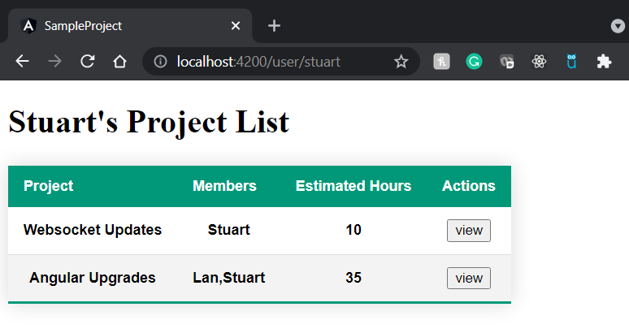
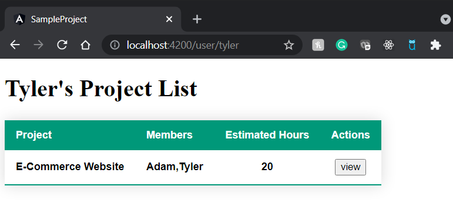
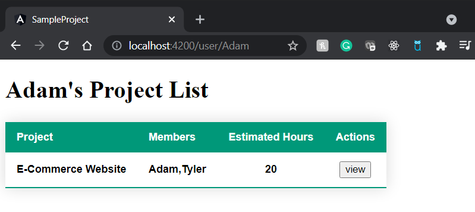
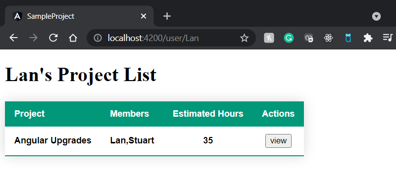
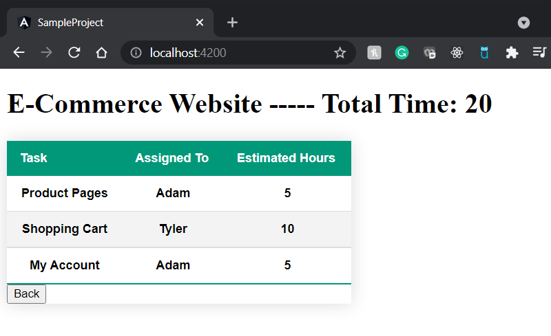
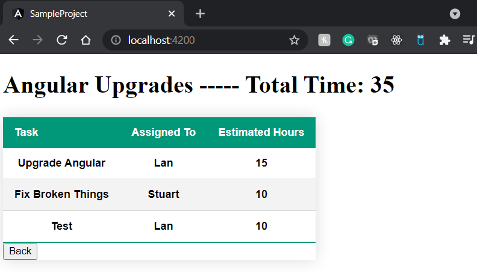
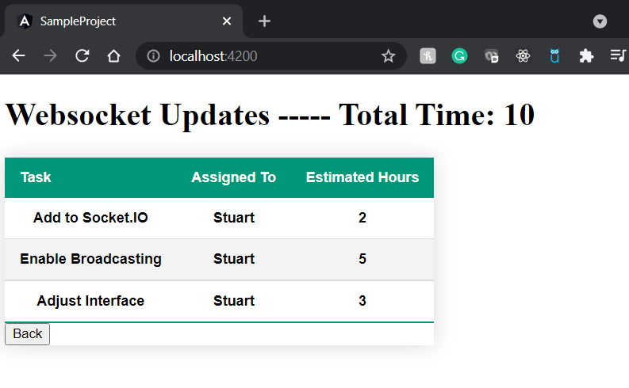

Instrucation on how to run:

1. Open XAMPP
2. Start Apache and MySQL
3.  Open command line and cd into the sample-project-api folder
4.  Run the following commands:

      --php artisan migrate:fresh
      
      --php artisan db:seed --class=UsersTableSeeder
      
      --php artisan db:seed --class=ProjectsTableSeeder
      
      --php artisan serve
      
5.  Open a new instance of command line and cd into the sample-project folder
6.  Run the following command:

       --ng serve

7.  Open browser and put in the address bar: "https://localhost:4200/user/{user}". Replace {name} with a real name (Stuart,Tyler, Adam or Lan)

